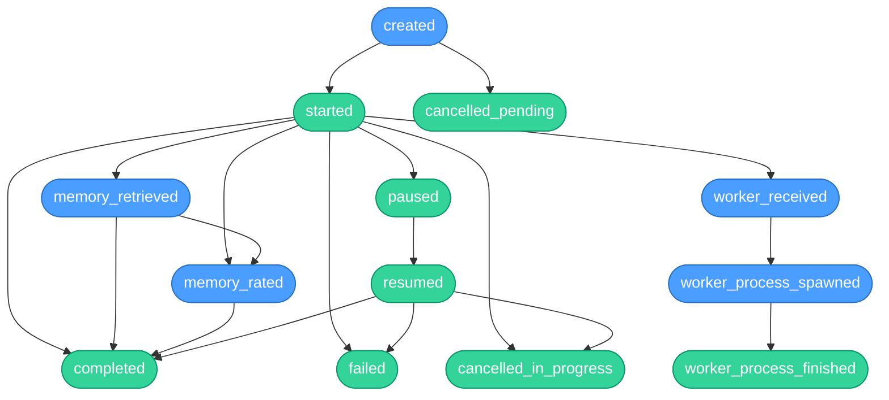
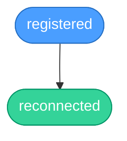
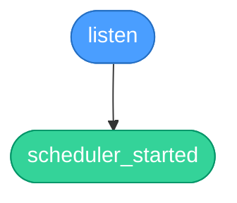

# Business-Use Flow Instrumentation

<!-- AUTO-GENERATED by scripts/generate-business-use-docs.ts — do not edit manually -->
<!-- Last generated: 2026-05-06 18:18:10 UTC -->

This document describes the business-use event flows instrumented in agent-swarm.
Events are tracked via the [`@desplega.ai/business-use`](https://github.com/desplega-ai/business-use) SDK.

**Legend:**
- 🔵 **act** — action event (no validator, tracks that something happened)
- 🟢 **assert** — assertion event (has a validator that checks invariants)

## Flows

### Flow: `task`

> **runId:** taskId (UUID)
> Tracks every task through its lifecycle — from creation to terminal state. Events are emitted from both the API server (state transitions) and Docker workers (process execution).



| Node | Type | Dependencies | Filter | Validator |
|------|------|-------------|--------|-----------|
| `cancelled_in_progress` | assert | started | ctx.deps.length > 0 | d.previousStatus === "in_progress" || d.previousStatus ==... |
| `cancelled_pending` | assert | created | ctx.deps.length > 0 | d.previousStatus === "pending" |
| `completed` | assert | started | ctx.deps.length > 0 | d.previousStatus === "in_progress" |
| `created` | act | — | — | — |
| `failed` | assert | started | ctx.deps.length > 0 | d.previousStatus === "in_progress" |
| `memory_rated` | assert | — | — | typeof data.memoryId === "string" && data.memoryId.length... |
| `memory_retrieved` | assert | — | — | typeof data.count === "number" && data.count > 0 && typeo... |
| `paused` | assert | started | ctx.deps.length > 0 | d.previousStatus === "in_progress" |
| `resumed` | assert | paused | ctx.deps.length > 0 | d.previousStatus === "paused" |
| `started` | assert | created | ctx.deps.length > 0 | d.previousStatus === "pending" |
| `worker_process_finished` | assert | worker_process_spawned | ctx.deps.length > 0 | d.exitCode === 0 |
| `worker_process_spawned` | act | worker_received | ctx.deps.length > 0 | — |
| `worker_received` | act | started | ctx.deps.length > 0 | — |

---

### Flow: `agent`

> **runId:** agentId (UUID)
> Tracks agent registration and reconnection to the swarm.



| Node | Type | Dependencies | Filter | Validator |
|------|------|-------------|--------|-----------|
| `reconnected` | assert | registered | ctx.deps.length > 0 | ctx.deps.length > 0 |
| `registered` | act | — | — | — |

---

### Flow: `api`

> **runId:** per-boot ID (`run_${Date.now()}`)
> Tracks API server boot and subsystem initialization.



| Node | Type | Dependencies | Filter | Validator |
|------|------|-------------|--------|-----------|
| `listen` | act | — | — | — |
| `scheduler_started` | assert | listen | Array.isArray(d.capabilities) && d.capabilities.includes(... | Array.isArray(d.capabilities) && d.capabilities.includes(... |

---

## Verification

```bash
# Start the business-use backend
uvx business-use-core@latest server dev

# List all runs for a flow
uvx business-use-core@latest flow runs --flow task

# Evaluate a specific task run
uvx business-use-core@latest flow eval <taskId> task --show-graph --verbose

# Evaluate an agent lifecycle
uvx business-use-core@latest flow eval <agentId> agent --show-graph --verbose

# Show the flow graph definition
uvx business-use-core@latest flow graph task
```

## Instrumentation Locations

| File | Side | Events |
|------|------|--------|
| `src/http/tasks.ts` | API | created, cancelled_pending, cancelled_in_progress, completed, failed, paused, resumed |
| `src/http/poll.ts` | API | started |
| `src/http/agents.ts` | API | registered, reconnected |
| `src/tools/store-progress.ts` | API | completed, failed (MCP path) |
| `src/be/memory/raters/store.ts` | API | memory_rated |
| `src/be/memory/raters/retrieval.ts` | API | memory_retrieved |
| `src/http/index.ts` | API | listen |
| `src/scheduler/scheduler.ts` | API | scheduler_started |
| `src/commands/runner.ts` | Worker | worker_received, worker_process_spawned, worker_process_finished |
