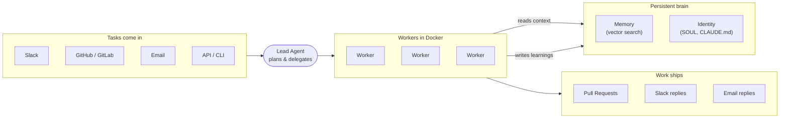

<p align="center">
  <a href="https://github.com/desplega-ai/agent-swarm/stargazers"></a>
  <a href="https://github.com/desplega-ai/agent-swarm/blob/main/LICENSE"></a>
  <a href="https://github.com/desplega-ai/agent-swarm/pulls"></a>
  <a href="https://discord.gg/KZgfyyDVZa"></a>
  <a href="https://docs.agent-swarm.dev"></a>
</p>

<p align="center">
  <b>Multi-agent orchestration for Claude Code, Codex, Gemini CLI, and other AI coding assistants.</b><br/>
  <sub>Built by <a href="https://desplega.sh">desplega.sh</a> — by builders, for builders.</sub>
</p>

<p align="center">
  <video src="https://github.com/user-attachments/assets/e220712e-c54d-4f46-b059-bac04639d229" controls muted playsinline width="720"></video>
</p>
<p align="center">
  <sub>▸ <a href="./assets/agent-swarm.mp4">daily evolution</a> · <a href="./assets/agent-swarm-slack-to-pr.mp4">slack → pr</a> · <a href="./assets/video-source">Making of</a></sub>
</p>

<p align="center">
  <a href="https://agent-swarm.dev">
    
  </a>
  <a href="https://docs.agent-swarm.dev">
    
  </a>
  <a href="https://app.agent-swarm.dev">
    
  </a>
  <a href="https://discord.gg/KZgfyyDVZa">
    
  </a>
  <a href="https://x.com/desplegalabs">
    
  </a>
</p>

> **What if your AI agents remembered everything, learned from every mistake, and got better with every task?**

## What it does

Agent Swarm runs a team of AI coding agents that coordinate autonomously. A **lead agent** receives tasks — from Slack, GitHub, GitLab, email, or the API — breaks them down, and delegates to **worker agents** running in Docker containers. Workers execute tasks, ship code, and write their learnings back to a shared memory so the whole swarm gets smarter every session.

Learn more in the [architecture overview](https://docs.agent-swarm.dev/docs/architecture/overview).



## Highlights

- **Lead/worker orchestration in Docker** — isolated dev environments, priority queues, pause/resume across deploys. [Architecture →](https://docs.agent-swarm.dev/docs/architecture/overview)
- **Compounding memory & persistent identity** — agents remember past sessions and evolve their own persona, expertise, and notes. [Memory →](https://docs.agent-swarm.dev/docs/architecture/memory) · [Agents →](https://docs.agent-swarm.dev/docs/architecture/agents)
- **Multi-channel inputs** — Slack, GitHub, GitLab, email, Linear, Jira, and the HTTP API all create tasks. [Integrations](#integrations)
- **Workflow engine with Human-in-the-Loop** — DAG-based automation with approval gates, retries, and structured I/O. [Workflows →](https://docs.agent-swarm.dev/docs/concepts/workflows)
- **Scheduled & recurring tasks** — cron-based automation for standing work. [Scheduling →](https://docs.agent-swarm.dev/docs/concepts/scheduling)
- **Multi-provider** — run with Claude Code, OpenAI Codex, pi-mono, Devin, Claude Managed Agents, or opencode. [Harness config →](https://docs.agent-swarm.dev/docs/guides/harness-configuration) · [Add a new provider →](https://docs.agent-swarm.dev/docs/guides/harness-providers)
- **Skills & MCP servers** — reusable procedural knowledge and per-agent MCP servers with scope cascade. [MCP tools →](https://docs.agent-swarm.dev/docs/reference/mcp-tools)
- **Real-time dashboard** — monitor agents, tasks, and inter-agent chat. [app.agent-swarm.dev →](https://app.agent-swarm.dev)

## Quick Start

**Prerequisites:** [Docker](https://docker.com) and a [Claude Code](https://docs.anthropic.com/en/docs/claude-code) OAuth token (`claude setup-token`).

The fastest way is the onboarding wizard — it collects credentials, picks presets, and generates a working `docker-compose.yml`:

```bash
bunx @desplega.ai/agent-swarm onboard
```

Prefer manual setup? Clone and run with Docker Compose:

```bash
git clone https://github.com/desplega-ai/agent-swarm.git
cd agent-swarm
cp .env.docker.example .env
# edit .env — set API_KEY and CLAUDE_CODE_OAUTH_TOKEN
docker compose -f docker-compose.example.yml --env-file .env up -d
```

The API runs on port `3013`, with interactive docs at `http://localhost:3013/docs` and an OpenAPI 3.1 spec at `http://localhost:3013/openapi.json`.

<details>
<summary><strong>Other setups</strong></summary>

- **Local API + Docker workers** — run the API on your host, workers in Docker. See [Getting Started](https://docs.agent-swarm.dev/docs/getting-started).
- **Claude Code as the lead agent** — `bunx @desplega.ai/agent-swarm connect`, then tell Claude Code to register as the lead.

</details>

## How It Works

```
You (Slack / GitHub / Email / CLI)
        |
   Lead Agent  ←→  MCP API Server  ←→  SQLite DB
        |
   ┌────┼────┐
Worker  Worker  Worker
(Docker containers with full dev environments)
```

1. A task arrives via Slack DM, GitHub @mention, email, or the API.
2. The lead plans and delegates subtasks to workers.
3. Workers execute in isolated Docker containers (git, Node.js, Python, etc.).
4. Progress streams to the dashboard, Slack threads, or the API.
5. Results ship back out as PRs, issue replies, or Slack messages.
6. Session learnings are extracted and become memory for future tasks.

More detail in the [task lifecycle docs](https://docs.agent-swarm.dev/docs/concepts/task-lifecycle).

## Integrations

| Integration | What it does | Setup |
|---|---|---|
| **Slack** | DM or @mention the bot to create tasks; workers reply in threads | [Guide](https://docs.agent-swarm.dev/docs/guides/slack-integration) |
| **GitHub App** | @mention or assign the bot on issues/PRs; CI failures create follow-up tasks | [Guide](https://docs.agent-swarm.dev/docs/guides/github-integration) |
| **GitLab** | Same model as GitHub — webhooks on issues/MRs, `glab` preinstalled in workers | [Guide](https://docs.agent-swarm.dev/docs/guides/gitlab-integration) |
| **AgentMail** | Give each agent an inbox; emails become tasks or lead messages | [Guide](https://docs.agent-swarm.dev/docs/guides/agentmail-integration) |
| **Linear** | Bidirectional ticket sync via OAuth + webhooks | [Guide](https://docs.agent-swarm.dev/docs/guides/linear-integration) |
| **Jira Cloud** | OAuth 3LO ticket sync — assignee/comment events create tasks; lifecycle posts comments back | [Guide](https://docs.agent-swarm.dev/docs/guides/jira-integration) |
| **Sentry** | Workers can triage Sentry issues with the `/investigate-sentry-issue` command | [Guide](https://docs.agent-swarm.dev/docs/guides/sentry-integration) |

## Dashboard

Real-time monitoring of agents, tasks, and inter-agent chat. Use the hosted version at [app.agent-swarm.dev](https://app.agent-swarm.dev), or run locally:

```bash
cd new-ui && pnpm install && pnpm run dev
```

Opens at `http://localhost:5274`.

## [CLI](https://docs.agent-swarm.dev/docs/reference/cli)

```bash
bunx @desplega.ai/agent-swarm <command>
```

| Command | Description |
|---------|-------------|
| `onboard` | Set up a new swarm from scratch (Docker Compose wizard) |
| `connect` | Connect this project to an existing swarm |
| `api`     | Start the API + MCP HTTP server |
| `worker`  | Run a worker agent |
| `lead`    | Run a lead agent |
| `docs`    | Open documentation (`--open` to launch in browser) |

## Deployment

For production deployments (Docker Compose with multiple workers, systemd for the API, graceful shutdown, integration config), see [DEPLOYMENT.md](./DEPLOYMENT.md) and the [deployment guide](https://docs.agent-swarm.dev/docs/guides/deployment).

## Documentation

Everything lives at **[docs.agent-swarm.dev](https://docs.agent-swarm.dev)**. Good starting points:

- [Getting Started](https://docs.agent-swarm.dev/docs/getting-started) — install, configure, and run your first task
- [Architecture overview](https://docs.agent-swarm.dev/docs/architecture/overview) — how the swarm is wired together
- [CLI reference](https://docs.agent-swarm.dev/docs/reference/cli) and [Environment variables](https://docs.agent-swarm.dev/docs/reference/environment-variables)
- [API reference](https://docs.agent-swarm.dev/docs/api-reference) — every HTTP endpoint

## Contributing

We love contributions! Whether it's bug reports, feature requests, docs improvements, or code — all are welcome.

See [CONTRIBUTING.md](./CONTRIBUTING.md) to get started. The quickest way to contribute:

1. Fork the repo
2. Create a branch (`git checkout -b my-feature`)
3. Make your changes
4. Open a PR

Join our [Discord](https://discord.gg/KZgfyyDVZa) if you have questions or want to discuss ideas.

## Star History

<a href="https://star-history.com/#desplega-ai/agent-swarm&Date">
 <picture>
   <source media="(prefers-color-scheme: dark)" srcset="https://api.star-history.com/svg?repos=desplega-ai/agent-swarm&type=Date&theme=dark" />
   <source media="(prefers-color-scheme: light)" srcset="https://api.star-history.com/svg?repos=desplega-ai/agent-swarm&type=Date" />
   
 </picture>
</a>

## License

[MIT](./LICENSE) — 2025-2026 [desplega.sh](https://desplega.sh)
