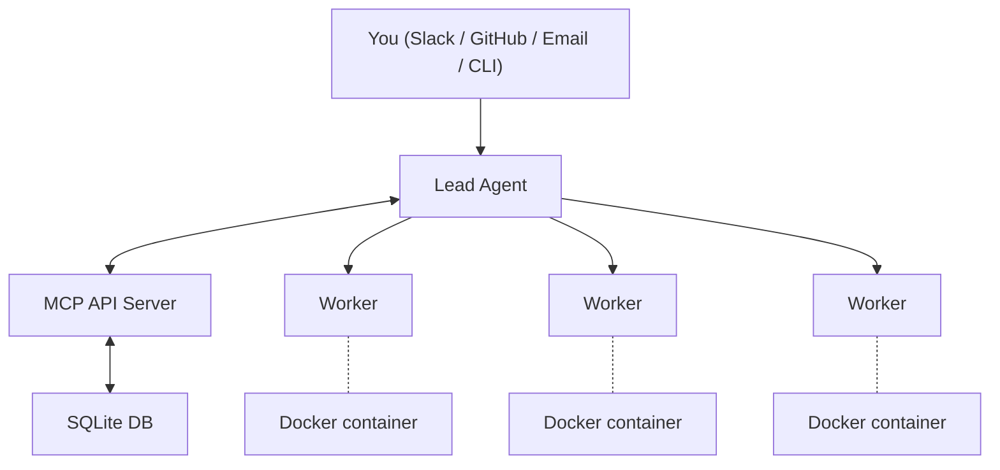

Agent Swarm follows a hub-and-spoke architecture where a central MCP API server coordinates communication between agents.

## System Diagram



## Core Components

### MCP API Server

The MCP (Model Context Protocol) server is the central coordination point. It:

- Exposes tools via the MCP protocol (both STDIO and HTTP transports)
- Manages agent registration and task assignment
- Stores all state in a SQLite database
- Handles integrations (Slack, GitHub, GitLab, AgentMail, Linear webhooks)
- Runs the task scheduler for recurring automation

The server runs on port `3013` by default and is implemented in `src/http/` (modular route handlers) with tool definitions in `src/server.ts`.

It also runs three background subsystems:
- **Scheduler** — Polls for scheduled tasks and creates them at the configured interval
- **Workflow Engine** — Redesigned DAG executor with executor registry (8 types), checkpoint durability, webhook/schedule/manual triggers, per-step retry, and version history (see [Workflows](/docs/concepts/workflows))
- **Heartbeat** — A lightweight triage module that sweeps the swarm every 90 seconds (configurable via `HEARTBEAT_INTERVAL_MS`). It uses a 3-tier approach: a preflight gate that bails if the swarm is healthy, code-level triage for routine fixes (stall detection, worker status correction, pool task auto-assignment, stale resource cleanup), and Claude escalation only when ambiguous situations require human reasoning. The lead agent also triggers a heartbeat sweep on startup to immediately detect and recover any stalled tasks from before restart. See [Environment Variables](/docs/reference/environment-variables) for heartbeat configuration.

### Lead Agent

The lead agent is the coordinator. It:

- Receives incoming tasks from external sources (Slack, GitHub, email)
- Has an **inbox** for triaging incoming messages
- Breaks down complex tasks and delegates to workers
- Monitors worker progress and provides feedback
- Communicates results back to the user
- Can inject learnings into worker memories

### Worker Agents

Workers are the execution layer. Each worker:

- Runs in an isolated Docker container with a full development environment
- Uses a configurable AI harness — Claude Code (default) or pi-mono — selected via `HARNESS_PROVIDER`. See [Harness Configuration](/docs/guides/harness-configuration)
- Has access to git, Node.js, Python, Bun, and common CLI tools
- Executes tasks assigned by the lead agent
- Reports progress via the `store-progress` MCP tool
- Can expose HTTP services on port 3000
- Learns from each session and builds compounding knowledge

### Docker Runtime

Each worker container includes:

- **Languages**: Python 3, Node.js 22, Bun
- **Build tools**: gcc, g++, make, cmake
- **Process manager**: PM2 (for background services)
- **CLI tools**: GitHub CLI (`gh`), GitLab CLI (`glab`), sqlite3
- **Agent tools**: `wts` (git worktree manager), `agent-fs` (persistent shared filesystem)
- **Utilities**: git, git-lfs, vim, nano, jq, curl, wget, ssh
- **Sudo access**: Workers can install packages with `sudo apt-get install`

## Data Flow

### Task Creation

1. User sends a message (Slack DM, GitHub @mention, email, or API call)
2. MCP server receives the webhook/request
3. Lead agent's inbox receives the message
4. Lead agent triages and creates tasks for workers

### Task Execution

1. Worker polls for or receives a task assignment
2. Worker starts a Claude Code session with the task context
3. Worker executes the task, using MCP tools for coordination
4. Worker reports progress via `store-progress`
5. On completion, output is saved and the lead is notified

### Learning Loop

1. At session end, a summary model extracts key learnings
2. Learnings are embedded and stored in the memory system
3. On next task, relevant memories are retrieved and included in context
4. The lead can also inject learnings directly into workers

## Project Structure

```
agent-swarm/
├── src/
│   ├── cli.tsx          # CLI entry point (Ink/React)
│   ├── http/            # Modular HTTP route handlers
│   │   ├── index.ts     # Handler registry & dispatch
│   │   ├── tasks.ts     # Task endpoints
│   │   ├── agents.ts    # Agent endpoints
│   │   ├── schedules.ts # Schedule endpoints
│   │   ├── core.ts      # Core endpoints (join, poll, progress)
│   │   ├── config.ts    # Config endpoints
│   │   ├── memory.ts    # Memory endpoints
│   │   ├── db-query.ts  # Read-only SQL query endpoint
│   │   ├── workflows.ts # Workflow CRUD + trigger endpoints
│   │   └── ...          # Additional route modules
│   ├── server.ts        # MCP server setup & tool registration
│   ├── tools/           # MCP tool implementations
│   ├── heartbeat/       # Lightweight swarm triage module
│   │   └── heartbeat.ts # 3-tier heartbeat (gate → code triage → escalation)
│   ├── be/              # Backend (database, business logic)
│   │   ├── db.ts        # SQLite database
│   │   └── migrations/  # Database migration system
│   ├── workflows/      # Workflow automation engine (DAG executor, triggers, nodes)
│   ├── artifact-sdk/    # Artifact SDK (serve files/apps via localtunnel)
│   ├── providers/       # AI provider adapters (formatCommand for provider-aware prompts)
│   │   ├── types.ts     # ProviderAdapter interface
│   │   ├── claude-adapter.ts  # Claude Code adapter
│   │   └── pi-mono-adapter.ts # Pi-mono adapter
│   ├── oauth/           # Generic OAuth module (PKCE, token management)
│   ├── gitlab/          # GitLab webhook handlers
│   ├── commands/        # CLI command implementations
│   │   ├── runner.ts    # Task runner (polls and spawns sessions)
│   │   ├── worker.ts    # Worker agent command
│   │   ├── lead.ts      # Lead agent command
│   │   └── artifact.ts  # Artifact serve/list/stop commands
│   └── hooks/           # Claude Code hooks
├── templates/           # Agent templates (official + community)
├── templates-ui/        # Templates registry (Next.js app)
├── deploy/              # Deployment scripts
├── scripts/             # Utility scripts
├── new-ui/              # Dashboard UI (React + AG Grid)
├── docker-compose.example.yml
├── Dockerfile           # API server image
├── Dockerfile.worker    # Worker image
└── package.json
```

## Technology Stack

| Component | Technology |
|-----------|-----------|
| Runtime | Bun |
| API Protocol | MCP (Model Context Protocol) |
| Database | SQLite (via `bun:sqlite`) |
| AI Runtime | Claude Code (default) or pi-mono — selected via `HARNESS_PROVIDER`. See [Harness Configuration](/docs/guides/harness-configuration) |
| Containerization | Docker |
| Process Management | PM2 |
| Memory Embeddings | OpenAI `text-embedding-3-small` |
| Dashboard | React + Vite |
| Schema Validation | Zod |

## Next Steps

- [Agent Identity & Configuration](/docs/architecture/agents) — How agents are personalized and evolve
- [Hook System](/docs/architecture/hooks) — The six hooks that fire during each session
- [Memory System](/docs/architecture/memory) — How agents build compounding knowledge
- [Task Lifecycle](/docs/concepts/task-lifecycle) — How tasks flow through the swarm
- [Deployment Guide](/docs/guides/deployment) — Production deployment options
