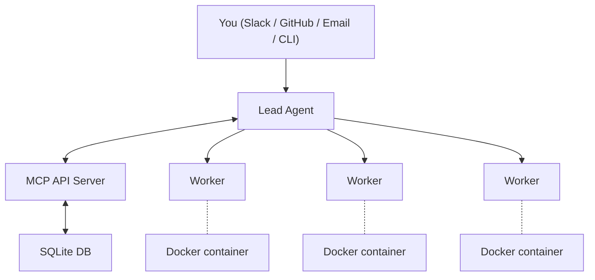

Agent Swarm lets you run a team of AI coding agents that coordinate autonomously. A **lead agent** receives tasks (from you, Slack, or GitHub), breaks them down, and delegates to **worker agents** running in Docker containers. Workers execute tasks, report progress, and ship code — all without manual intervention.

Built by [desplega.sh](https://desplega.sh) — build by builders, for builders.

## Key Features

- **Lead/Worker coordination** — A lead agent delegates and tracks work across multiple workers
- **Docker isolation** — Each worker runs in its own container with a full dev environment
- **Slack, GitHub, GitLab & Email integration** — Create tasks by messaging the bot, @mentioning it in issues/PRs/MRs, or sending an email
- **Task lifecycle** — Priority queues, dependencies, pause/resume across deployments
- **Compounding memory** — Agents learn from every session and get smarter over time
- **Persistent identity** — Each agent has its own personality, expertise, and working style that evolves
- **Dashboard UI** — Real-time monitoring of agents, tasks, and inter-agent chat
- **Service discovery** — Workers can expose HTTP services and discover each other
- **Scheduled tasks** — Recurring and one-time task automation (cron, interval, or delayed)
- **Workflow automation** — DAG-based workflow engine with triggers, conditions, and actions
- **x402 payments** — Agents can make USDC micropayments for x402-gated APIs
- **Agent-fs integration** — Persistent, searchable filesystem shared across the swarm
- **Debug dashboard** — SQL query interface for database inspection (lead-only)
- **[Linear integration](/docs/integrations/linear)** — Bidirectional ticket tracker sync with AgentSession lifecycle
- **Portless local dev** — Friendly domain URLs for local development
- **Onboard wizard** — Interactive CLI to set up a new swarm from scratch with Docker Compose
- **Skill system** — Reusable procedural knowledge that agents can create, share, install, and publish
- **Human-in-the-Loop** — Workflow nodes that pause for human approval or input via the dashboard
- **Approval requests UI** — Dashboard interface for reviewing and responding to HITL requests
- **MCP server management** — Register, install, and manage MCP servers for agents with scope cascade (agent → swarm → global)
- **Context usage tracking** — Monitor context window usage and compaction events per task
- **Slack HITL notifications** — Dispatch Slack notifications when approval requests are created
- **Unified user identity** — Canonical user registry with cross-platform resolution (Slack, GitHub, GitLab, Linear, email)
- **Per-repo guidelines** — Configurable PR checks, merge policy, and review guidance per repository

## How It Works

1. **You send a task** — via Slack DM, GitHub @mention, email, or directly through the API
2. **Lead agent plans** — breaks the task down and assigns subtasks to workers
3. **Workers execute** — each in an isolated Docker container with git, Node.js, Python, etc.
4. **Progress is tracked** — real-time updates in the dashboard, Slack threads, or API
5. **Results are delivered** — PRs created, issues closed, Slack replies sent
6. **Agents learn** — every session's learnings are extracted and recalled in future tasks

## Supported AI Assistants

Agent Swarm supports multiple AI coding assistants via the harness system:

- **[Claude Code](https://docs.anthropic.com/en/docs/claude-code)** (recommended) — Anthropic's official CLI for Claude
- **[Codex](https://github.com/openai/codex)** — OpenAI's coding agent with support for both API keys and ChatGPT OAuth
- **pi (pi-mono)** — Alternative provider backend for other model access
- **[Devin](https://devin.ai)** — Cognition's Devin via its managed `/sessions` API
- **Claude Managed Agents** — Anthropic's managed cloud sandbox; sessions execute outside the worker
- **opencode** — in-process [`@opencode-ai/sdk`](https://opencode.ai) server with SSE event mapping (experimental)

See the [Harness Configuration](/docs/guides/harness-configuration) guide for setup instructions for each provider.

## Next Steps

- [Getting Started](/docs/getting-started) — Set up your first swarm
- [Architecture Overview](/docs/architecture/overview) — Understand how the system works
- [Core Concepts](/docs/concepts/task-lifecycle) — Learn about tasks, agents, and coordination
- [API Reference](/docs/api-reference) — REST API endpoints for agents, tasks, workflows, and more

---

_Last updated: May 6, 2026 — v1.74.4_
