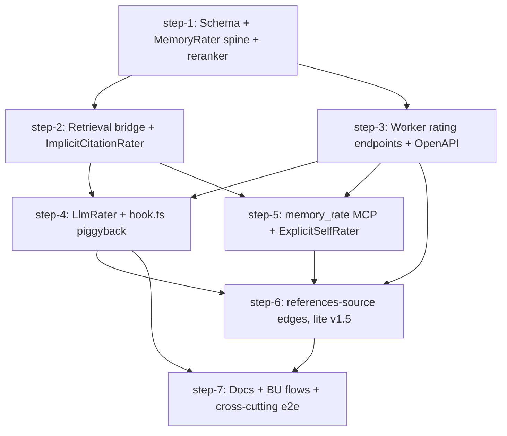

# Memory Rater v1.5 (Beta posteriors + 3 raters + references-source edges) — Plan (DAG)

## Overview

Ship the brainstorm-resolved memory-rater framework — Beta-Binomial usefulness posteriors per memory, three pluggable raters (`ImplicitCitation`, `LlmRater`, `ExplicitSelfRating`), two new HTTP endpoints, a reranker `usefulness` factor, and the swarm's first **synaptic edge** (`agent_memory_edge` with edge `type='references-source'` only). v1.5 = v1 (neurons + plasticity) + the single most useful edge type, deferring the full graph to v2.

- **Motivation**: Today's reranker is a deterministic `similarity × recency_decay × access_boost` formula with no feedback loop (`src/be/memory/reranker.ts:37-43`). The brainstorm landed on a Bayesian usefulness signal as the smallest, most-decisive learning hook — and the "knowledge-not-data" edge wedge (`references-source`) anchors memories to external sources of truth without committing to a full synaptic graph.
- **Related**:
  - Brainstorm (canonical PRD): [`thoughts/taras/brainstorms/2026-05-04-memory-rater-abstraction.md`](../../brainstorms/2026-05-04-memory-rater-abstraction.md)
  - Background research: [`thoughts/taras/research/2026-05-04-bayesian-learning-memory.md`](../../research/2026-05-04-bayesian-learning-memory.md)
  - Wedge framing: Lead's "Block — From Hierarchy to Intelligence" reply (Slack thread, 2026-05-05).
  - Runbook to update: [`runbooks/memory-system.md`](../../../../runbooks/memory-system.md)

## Current State Analysis

- `agent_memory` schema (`src/be/migrations/001_initial.sql:271-287`) has no `alpha`/`beta` columns. No `memory_retrieval` or `memory_rating` tables exist anywhere.
- Reranker (`src/be/memory/reranker.ts:15-59`) multiplies `similarity × recency_decay × access_boost`. There is **no** feedback factor and `accessCount` only increments on explicit `get(id)` (`src/be/memory/providers/sqlite-store.ts:200-213`), not on `search()` recall — so today's "access boost" is ~useless as a quality signal.
- HTTP `POST /api/memory/search` (`src/http/memory.ts:184-228`) has `X-Agent-ID` but does **not** read `X-Source-Task-ID`, so retrieved memories cannot be tied back to a task on the server.
- `RequestInfo.sourceTaskId` already extracts `x-source-task-id` (`src/tools/utils.ts:18-44`) — header-plumbing is one line in the runner + one parameter in the in-process search call.
- Worker-side runner search call lives near `src/commands/runner.ts:1540-1560` (already includes `X-Agent-ID`). The session-summary LLM call lives in `src/hooks/hook.ts:1080-1145` and shells out to `claude -p --model haiku --output-format json` — the LlmRater piggybacks on this exact call.
- Server-side post-task memory write hook is in `src/tools/store-progress.ts:295-359` — natural spot to fire the server-side `ImplicitCitationRater`.
- DB-boundary invariant (`scripts/check-db-boundary.sh`, pre-push + CI) blocks `bun:sqlite` / `src/be/db` imports from `src/commands/`, `src/hooks/`, `src/providers/`, `src/prompts/`, `src/cli.tsx`, `src/claude.ts`. Worker-side raters MUST go through HTTP.
- Latest applied migration is `048_agent_provider.sql`. New migrations land at `049_*` (brainstorm spine) and `050_*` (edges, v1.5).
- `BUSINESS_USE.md` is **auto-generated** (`scripts/generate-business-use-docs.ts`); it must be regenerated via `bun run docs:business-use`, not hand-edited.
- Existing brainstorm references the FK target as `tasks(id)`; the actual table name is `agent_tasks` — see `src/be/migrations/001_initial.sql:195`. Plan uses `agent_tasks(id)` (see Deviation A in step-1).

## Desired End State

A coder running `bun run start:http` against a fresh DB with `MEMORY_RATERS=implicit-citation,llm,explicit-self` set should observe:

1. A memory retrieval through `/api/memory/search` with `X-Source-Task-ID` inserts a `memory_retrieval` row.
2. On task completion, the `ImplicitCitationRater` scans `session_logs` for that `taskId`, emits `RatingEvent[]`, and the corresponding `agent_memory.alpha`/`beta` columns move accordingly. A `memory_rating` audit row is written per event.
3. At session shutdown, the worker's summary call (`hook.ts`) ALSO returns a Zod-validated `ratings: [{ id, score, reasoning, referencesSource? }]` array. The worker GETs `/api/memory/retrievals?taskId=` to know which memories to rate, then POSTs the resulting `RatingEvent[]` to `/api/memory/rate`.
4. An agent in mid-task can call the new `memory_rate(id, useful, note?, referencesSource?)` MCP tool. Server validates the `id` is in `memory_retrieval` for that task, enforces "at most one explicit-self rating per (taskId, memoryId)" via partial unique index, and returns 409 on duplicate.
5. The reranker now multiplies `similarity × recency_decay × access_boost × usefulness(α, β)` where `usefulness = clamp(2 × α/(α+β), MEMORY_DEMOTION_FLOOR, 2.0)`. With `MEMORY_DEMOTION_FLOOR` defaulted to `1.0` and prior `Beta(1,1)`, `usefulness = 1.0` exactly — strict no-op vs. today.
6. With `MEMORY_RATERS` unset/empty, `usefulness` returns `1.0` for every row (NoopRater alone), and reranker output matches a pre-change snapshot byte-for-byte.
7. When `memory_rate` (or the LlmRater) attaches `referencesSource: "github:desplega-ai/agent-swarm#377"` (or any other free-form `<source>:<identifier>` string — see Q2 below), an `agent_memory_edge` row exists with `from_id=memoryId, to_id=<that string>, type='references-source'`, and its own `(alpha, beta)` move identically. `GET /api/memory/edges?memoryId=…` returns the edge.

Verified by the cross-cutting integration test in step-7 plus per-step automated checks.

## What We're NOT Doing

- **No edge-aware reranking.** Edges are write-and-read only in v1.5; the reranker ignores them. (v2.)
- **No edge GC.** Edges live forever in v1.5 — there's no `ON DELETE CASCADE` from external entity IDs (they're opaque free-form strings). (v2.)
- **No closed enum / typed parser / `CHECK` constraint for `to_id` prefixes.** Q2 LOCKED: `to_id` is a free-form string with a documentation-only convention (`<source>:<identifier>`). Adding the 51st integration must require zero swarm-side code change. **Do NOT model on `src/tasks/context-key.ts`** — that file uses a closed enum because tasks are core scheduling primitives; `references-source.to_id` is the opposite (an open extension point). See step-6 §1 (Q2/Q3 resolved sections) for the full contract.
- **No multi-type edges.** `agent_memory_edge.type` is constrained by SQL `CHECK type='references-source'` so any future PR adding `'supersedes'`, `'contradicts'`, or `'references-{linear,github,notion}'` requires a forward migration that lifts the constraint. Hooks reserved (table column already exists). (v2.)
- **No supersedes / contradicts edges.** (v2.)
- **No Thompson sampling.** Posterior mean only, deterministically clamped. The research doc's Thompson sampling option (§3.B) is deferred until telemetry shows mean-only is starving new memories.
- **No PicHunter / Naive-Bayes feature-conditional model.** (Research §3.C — deferred.)
- **No bandit over embedding models / harness providers.** (Research §4 — deferred.)
- **No `memory_rerate` tool.** Brainstorm R6 explicitly defers the override path to a follow-up release.
- **No content-substring or n-gram detector** for the implicit rater. ID-grep only — content matching ships as a separate `MemoryRater` if recall data warrants it.
- **No new SDK dependencies.** LlmRater shells to `claude -p` like `hook.ts:1097` does today. Anthropic-SDK / OpenRouter / OpenAI client impls drop in behind env later without touching rater logic.
- **No down migration.** Forward-only per [`CLAUDE.md`'s migration rule](../../../../CLAUDE.md).
- **No reranker behaviour change for existing memories.** `usefulness` is floored at `MEMORY_DEMOTION_FLOOR` (default `1.0` = no demotion) — proven memories climb up to 2.0 only. Lower the floor per deployment when telemetry shows reliable negative signal; default ships unchanged.

## Implementation Approach

- **Spine first, raters second, edges third.** Step-1 ships the framework with `NoopRater` only (strict no-op). Steps 2–5 light up the three raters. Step-6 layers the `references-source` edge as an optional field on the existing rating path. Step-7 documents and end-to-end-tests the whole feature.
- **Two migration files, both forward-only**: `049_memory_posteriors_and_retrieval.sql` (brainstorm spine: `alpha`/`beta` columns, `memory_retrieval`, `memory_rating`, indexes, partial unique index for explicit-self). `050_memory_edges.sql` (v1.5: `agent_memory_edge` with `CHECK type='references-source'`, indexes). Single migration each — no schema patches scattered across steps.
- **Server-side `applyRating(events)` helper is the single chokepoint** for `(alpha, beta)` updates and `memory_rating` audit writes. Lives in `src/be/memory/raters/store.ts`. Both server-internal calls (`ImplicitCitationRater` from `store-progress.ts`) and the HTTP endpoint (`POST /api/memory/rate`) call this helper. One transaction per call.
- **`MemoryRater` interface mirrors `EmbeddingProvider` / `MemoryStore`** — pluggable, env-var registered (`MEMORY_RATERS=...`), default = `NoopRater`. Each rater returns `RatingEvent[]`; the framework sets `source` (= rater name) so raters cannot spoof each other.
- **Worker raters POST events; server raters call `applyRating` directly.** DB-boundary invariant means workers cannot touch SQLite — confirmed by `scripts/check-db-boundary.sh`.
- **Reranker change is one new helper + one multiplier**: add `usefulness(α, β) = clamp(2 × α/(α+β), MEMORY_DEMOTION_FLOOR, 2.0)` to `src/be/memory/reranker.ts`, multiply into `computeScore`. At default prior + default floor, returns `1.0` — strict no-op vs. today. The floor is env-configurable (`MEMORY_DEMOTION_FLOOR`, default `1.0`); lower it once telemetry shows reliable negative signal (per brainstorm "Resolved during file-review §1").
- **`references-source` edge piggybacks `applyRating`.** When a `RatingEvent` has `referencesSource`, `applyRating` UPSERTs into `agent_memory_edge` with the same Beta-update math used on the memory itself. Single optional field, single code path.
- **Backward compatibility is structural, not flag-gated.** `MEMORY_RATERS` unset → `NoopRater` only → posteriors stay at `Beta(1,1)` → `usefulness = 1.0` (with `MEMORY_DEMOTION_FLOOR=1.0` default) → reranker output identical. Older servers without `/api/memory/rate` → workers POST → 404 → caught + swallowed (existing pattern from runner.ts memory-search call).

### Sequencing decision (why this DAG shape)

- **step-1 is the only true serial bottleneck**: it ships migrations + interface + reranker change. Everything else gates on it.
- **steps 2 + 3 can run in parallel** (both depend only on step-1). step-2 lights up the server-side rater + the retrieval-bridge plumbing; step-3 ships the worker-facing endpoints. They touch disjoint files except for `applyRating` (created in step-1) and OpenAPI regen (step-3 only).
- **steps 4 + 5 can run in parallel** (both depend on steps 2 + 3). step-4 = LlmRater + hook piggyback; step-5 = `memory_rate` MCP tool + ExplicitSelfRater + conditional system-prompt + spam-guard.
- **step-6 (edges) depends on step-3 + step-5** — it extends the `POST /api/memory/rate` Zod schema (step-3) and the `memory_rate` tool input (step-5). step-4's `LlmRater` Zod schema is also extended in step-6 (the LLM is allowed to suggest a `referencesSource` per rating); step-6 explicitly depends on step-4 too so the Zod-schema edits don't conflict.
- **step-7 is the capstone**: docs (`runbooks/memory-system.md`, `MCP.md`), `bun run docs:business-use` regen, `bun run docs:openapi` final check, and the cross-cutting end-to-end test that exercises all three raters + the edge path together.

## Quick Verification Reference

Common commands any step or wave will use:

- Tests: `bun test`
- Lint: `bun run lint:fix`
- Typecheck: `bun run tsc:check`
- DB boundary: `bash scripts/check-db-boundary.sh`
- Memory-system test suite (per `runbooks/memory-system.md`):
  ```bash
  bun test src/tests/memory-reranker.test.ts
  bun test src/tests/memory-store.test.ts
  bun test src/tests/memory.test.ts
  bun test src/tests/memory-e2e.test.ts
  ```
- OpenAPI regen: `bun run docs:openapi`
- BUSINESS_USE regen: `bun run docs:business-use` (requires the BU backend; see `<important>` block in `CLAUDE.md`)
- Fresh-DB migration test: `rm agent-swarm-db.sqlite && bun run start:http` (then verify tables via sqlite shell)

## DAG



Wave structure (after step-1 lands):

| Wave | Steps that can run in parallel |
|------|--------------------------------|
| 0    | step-1 |
| 1    | step-2, step-3 |
| 2    | step-4, step-5 |
| 3    | step-6 |
| 4    | step-7 |

## Steps

| ID | Name | Depends on | Status | File |
|----|------|------------|--------|------|
| step-1 | Schema + MemoryRater spine + reranker `usefulness` factor | — | ready | [step-1.md](./step-1.md) |
| step-2 | Retrieval bridge + `ImplicitCitationRater` | step-1 | ready | [step-2.md](./step-2.md) |
| step-3 | Worker rating endpoints (`/api/memory/rate`, `/retrievals`) + OpenAPI | step-1 | ready | [step-3.md](./step-3.md) |
| step-4 | `LlmRater` + `hook.ts` summary-call piggyback | step-2, step-3 | ready | [step-4.md](./step-4.md) |
| step-5 | `memory_rate` MCP tool + `ExplicitSelfRatingRater` + conditional prompt | step-2, step-3 | ready | [step-5.md](./step-5.md) |
| step-6 | `references-source` edges (table + optional field + `GET /api/memory/edges`) | step-3, step-4, step-5 | ready | [step-6.md](./step-6.md) |
| step-7 | Docs + BU flows + cross-cutting e2e + global verification | step-4, step-6 | ready | [step-7.md](./step-7.md) |

> **Canonical dependencies and execution status live in each `step-<n>.md`'s frontmatter.** This table is a derived snapshot at plan creation. During `/v-implement`, frontmatter `status` (`ready` → `claimed` → `done`) is the source of truth — re-render this table when you want a current view.

## Pre-flight Verification

Run before kicking off any step (orchestrator's responsibility — `/v-implement` performs these once at the start of the run):

- [ ] Working tree is clean (or only contains intentional in-flight work).
- [ ] Baseline tests pass on the current branch: `bun test`.
- [ ] Baseline typecheck passes: `bun run tsc:check`.
- [ ] DB-boundary check passes on `main`: `bash scripts/check-db-boundary.sh`.
- [ ] Fresh-DB cold start succeeds against `main`: `rm agent-swarm-db.sqlite && bun run start:http` exits cleanly with all 048 migrations applied.
- [ ] `bun run docs:openapi` is a no-op on `main` (spec already fresh).

## Global Verification

Run after all steps complete (final wave gate — owned by step-7):

- [ ] Whole-repo typecheck: `bun run tsc:check`.
- [ ] Full test suite: `bun test`.
- [ ] DB-boundary check: `bash scripts/check-db-boundary.sh`.
- [ ] Fresh-DB cold start applies migrations 049 + 050 cleanly: `rm agent-swarm-db.sqlite && bun run start:http` and verify via sqlite shell that `agent_memory.alpha/beta`, `memory_retrieval`, `memory_rating`, `agent_memory_edge` all exist with the documented columns/indexes.
- [ ] **Backward-compat snapshot**: with `MEMORY_RATERS=` unset and `MEMORY_DEMOTION_FLOOR` unset (default `1.0`), the `memory-reranker.test.ts` snapshot output matches the pre-change baseline byte-for-byte (no behavioural drift when raters are off).
- [ ] **Cross-cutting e2e** (step-7-owned): with `MEMORY_RATERS=implicit-citation,llm,explicit-self`, run a synthetic task that retrieves two memories, cites one in `session_logs`, calls `memory_rate(id, useful=true, referencesSource="github:desplega-ai/agent-swarm#999")` on the other, completes, and verify:
  - both `agent_memory.alpha/beta` rows moved as expected;
  - `memory_rating` rows exist for both signals (`implicit-citation` + `explicit-self`);
  - the LlmRater summary call also produced rating rows for any retrieved memories;
  - `agent_memory_edge` row exists with the cited PR ID;
  - `GET /api/memory/edges?memoryId=…` returns the edge;
  - reranker `usefulness` factor applied — verify by re-searching the same query, the cited memory ranks higher.
- [ ] OpenAPI freshness: `bun run docs:openapi` is a no-op on the final commit.
- [ ] BUSINESS_USE regeneration: `bun run docs:business-use` produces a clean diff (or no diff after step-7's commit).
- [ ] `runbooks/memory-system.md`, `MCP.md` updated and link-checkable.
- [ ] No `MEMORY_RATERS`-related env touched in `.env.example` without a corresponding line in CLAUDE.md. Same applies to `MEMORY_DEMOTION_FLOOR` (Q1 resolution): document in `.env.example` with the default `1.0` and its semantics.

## Appendix

- **Follow-up plans** (out-of-scope for v1.5, captured for future):
  - **v2 — full synaptic graph**: lift the `CHECK type='references-source'` constraint, add `'supersedes'`, `'contradicts'`, `'references-linear'`, `'references-github'`, `'references-notion'`. Add edge-aware reranking (1–2 hop graph walk during candidate expansion). Add edge GC for stale external entity refs. Add cluster-level Beta priors for cold-start (research doc §3.F).
  - **`memory_rerate` tool**: explicit override path with replace + undo `(alpha, beta)` math. Brainstorm R6 explicitly defers this.
  - **Bandit over LlmRater models**: env-driven model selection eventually evolves into a bandit — research doc §4.
  - **Thompson sampling toggle**: behind a feature flag, or only on a 10% slice — research doc §3.B.
- **Derail notes**:
  - Brainstorm uses `tasks(id)` as the FK target for `memory_retrieval.taskId`; the actual table name is `agent_tasks` (`src/be/migrations/001_initial.sql:195`). The plan uses the correct name. See step-1 Deviation A.
  - `BUSINESS_USE.md` is auto-generated; treat it as a regen-and-commit step, not hand-edit. See step-7.
  - The brainstorm-supplied prompt copy in `src/prompts/memories.ts` for the explicit-self gating uses the wording verbatim from R6 §3 of the brainstorm; we ship that wording unchanged in step-5 to preserve the file-reviewed text.
- **References**:
  - Brainstorm: [`thoughts/taras/brainstorms/2026-05-04-memory-rater-abstraction.md`](../../brainstorms/2026-05-04-memory-rater-abstraction.md)
  - Bayesian research: [`thoughts/taras/research/2026-05-04-bayesian-learning-memory.md`](../../research/2026-05-04-bayesian-learning-memory.md)
  - Repo conventions: [`CLAUDE.md`](../../../../CLAUDE.md) (migration rules, OpenAPI freshness, business-use regen, secret-scrubbing, DB-boundary).
  - Memory runbook: [`runbooks/memory-system.md`](../../../../runbooks/memory-system.md).
